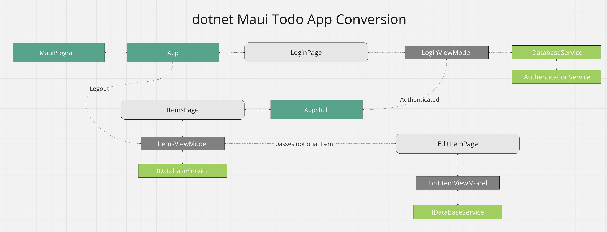

# Conversion Example of MongoDb Atlas Device Sync to Couchbase Lite for DotNet Maui Developers 

The original version of this [application](https://github.com/mongodb/template-app-maui-todo)  was built with the [MongoDb Atlas Device SDK](https://www.mongodb.com/docs/atlas/device-sdks/sdk/dotnet/) and [Atlas Device Sync](https://www.mongodb.com/docs/atlas/app-services/sync/). 

> **NOTE**
>The original application is a basic To Do list.  The original source code has it's own opinionated way of implementing an DotNet Maui application and communicating between different layers.  This conversion is by no means a best practice for Maui development or a show case on how to properly communicate between layers of an application.  It's more of an example of the process that a developer will have to go through to convert an application from one SDK to another.
>

Minor UI updates were made to replace references to Realm with Couchbase. Colors and icons were also updated to align with the Couchbase brand. The project’s name and namespace were left unchanged, as the goal is to provide a conversion example.

# Capella Configuration

Before running this application, you must have [Couchbase Capella App Services](https://docs.couchbase.com/cloud/get-started/configuring-app-services.html) set up.  Instructions for setting up Couchbase Capella App Services and updating the configuration file can be found in the [Capella.md](./Capella.md) file in this repository.  Please ensure you complete these steps first.

# App Overview
The following diagram shows the flow of the application



# Maui App Conversion

The following is information on the application conversion process and what files were changed.

## Nuget Changes

The application was initially built using .NET 7.0 and the .NET MAUI workload for that version. It has since been upgraded to .NET 8 and the corresponding .NET MAUI workload to take advantage of Microsoft’s long-term support (LTS) for this release.

The Realm SDK Nuget packages were removed from the project.  The [Couchbase Lite Nuget package](https://docs.couchbase.com/couchbase-lite/current/csharp/gs-install.html) was added to the [RealmToDo.csproj](https://github.com/couchbaselabs/cbl-template-app-maui-todo/blob/main/RealmTodo/RealmTodo.csproj#L48) file.  

```xml 
<ItemGroup>
  <PackageReference Include="Couchbase.Lite" Version="3.2.0" />
  <PackageReference Include="Microsoft.Extensions.Logging.Debug" Version="8.0.1" />
  <PackageReference Include="CommunityToolkit.Mvvm" Version="8.3.2" />
  <PackageReference Include="CommunityToolkit.Maui" Version="9.1.0" />
 </ItemGroup>
```
## App Services Configuration File

The original source code had the configuration for Atlas App Services stored in the atlasConfig.json file located projects root folder.  This file was removed and the configuration for Capella App Services was added in the [capellaConfig.json](https://github.com/couchbaselabs/cbl-template-app-maui-todo/blob/main/RealmTodo/capellaConfig.json#L2).

You will need to modify this file to add your Couchbase Capella App Services endpoint URL, as outlined in the [Capella setup instructions](./Capella.md).

## FodyWeavers Removal
FodyWeawvers is used for the Realm Atlas Device SDK for LINQ support.  This was removed from the project as it is not needed for Couchbase Lite.

## Android Registration for Couchbase Lite
The Couchbase Lite SDK requires [registration of the SDK for Android](https://docs.couchbase.com/couchbase-lite/current/csharp/gs-install.html#activating-on-android-platform-only).  The [MainApplication](https://github.com/mongodb/template-app-maui-todo/blob/main/RealmTodo/Platforms/Android/MainApplication.cs) class was modified to register the Couchbase Lite SDK.

```csharp
[Application]
public class MainApplication : MauiApplication
{
 public MainApplication(IntPtr handle, JniHandleOwnership ownership)
 : base(handle, ownership)
 {
    Couchbase.Lite.Support.Droid.Activate(this);
 }
 protected override MauiApp CreateMauiApp() => MauiProgram.CreateMauiApp();
}
```

## Changes to Services 

### Registering of Interfaces, Services, ViewModels, and Views

The original source code relied on static classes for accessing services, which made testing challenging. To improve testability, the standard Dependency Injection (DI) pattern available in .NET MAUI was adopted.  The [MauiProgram.cs](https://github.com/couchbaselabs/cbl-template-app-maui-todo/blob/main/RealmTodo/MauiProgram.cs#L27) file was updated to register all services, view models, and views with the DI container using the builder.

```csharp
builder.Services.AddSingleton<IDatabaseService, CouchbaseService>();
builder.Services.AddSingleton<IAuthenticationService, AuthenticationService>();
       
//add view models
builder.Services.AddTransient <EditItemViewModel>();
builder.Services.AddTransient <ItemsViewModel>();
builder.Services.AddTransient <LoginViewModel>();
        
//add the views
builder.Services.AddTransient <EditItemPage>();
builder.Services.AddTransient <ItemsPage>();
builder.Services.AddTransient <LoginPage>();
```

### Authentication

The original source code uses the [Realms.Sync.App](https://github.com/mongodb/template-app-maui-todo/blob/main/RealmTodo/Services/RealmService.cs#L12C24-L12C39) to [handle authentication](https://github.com/mongodb/template-app-maui-todo/blob/main/RealmTodo/Services/RealmService.cs#L75).  

The [Couchbase Lite SDK](https://docs.couchbase.com/couchbase-lite/current/android/replication.html#lbl-user-auth)  manages authentication differently than the [Mongo Realm SDK](https://www.mongodb.com/docs/atlas/device-sdks/sdk/dotnet/manage-users/authenticate/).  Code was added to deal with these differences. 

### Handling Authencation of the App

The authentication of the app is called from the [IAuthenticationService](https://github.com/couchbaselabs/cbl-template-app-maui-todo/blob/main/RealmTodo/Services/IAuthenticationService.cs#L5) interface.  The implementation [AuthenticationService](https://github.com/couchbaselabs/cbl-template-app-maui-todo/blob/main/RealmTodo/Services/AuthenticationService.cs#L6) was added to handle the authentication of the app. 

 Authentication is done via the Couchbase Capella App Services Endpoint public [REST API](https://docs.couchbase.com/cloud/app-services/references/rest_api_admin.html) in the CouchbaseService [LoginAsync method](https://github.com/couchbaselabs/cbl-template-app-maui-todo/blob/main/RealmTodo/Services/CouchbaseService.cs#L249) to resolve the SDK differences between Realm SDK and Couchbase Lite SDK without having to refactor large chunks of code. 

> **NOTE**
>Registering new users is out of scope of the conversion, so this functionaliy was removed.  Capella App Services allows the creating of Users per endpoint via the [UI](https://docs.couchbase.com/cloud/app-services/user-management/create-user.html#usermanagement/create-app-role.adoc) or the [REST API](https://docs.couchbase.com/cloud/app-services/references/rest_api_admin.html).  For large scale applications it's highly recommended to use a 3rd party [OpendID Connect](https://docs.couchbase.com/cloud/app-services/user-management/set-up-authentication-provider.html) provider. 
>

### Create User Model

The Couchbase Lite SDK doesn't provide a user object for tracking the authenticated user, so a [new model](https://github.com/couchbaselabs/cbl-realm-template-app-kotlin-todo/blob/main/app/src/main/java/com/mongodb/app/domain/User.kt) was created. 

### Updating Item Domain Model

The [Item](https://github.com/couchbaselabs/cbl-template-app-maui-todo/blob/main/RealmTodo/Models/Item.cs#L8) class was modified to remove the Realm annotations and to refactor some properties to meet standard .NET naming conventions.

The .NET serialization library makes it easy to convert the item class to a JSON string for storage in Couchbase Lite, so changes were made to the class to make it serializable by the .NET serialization library.

Some fields need to be "Observable" in order for the UI in the application to dynamically update if changes are detected.  Those fields the SetProperty and OnPropertyChanged methods were implemented from the [MVVM toolkit](https://learn.microsoft.com/en-us/dotnet/communitytoolkit/mvvm/). 

### IDatabaseService Interface

The original source code had a [RealmService](https://github.com/mongodb/template-app-maui-todo/blob/main/RealmTodo/Services/RealmService.cs#L8) class that was used to interact with the Realm Atlas Device SDK and was a static class.  This was replaced with an [IDatabaseService](https://github.com/couchbaselabs/cbl-template-app-maui-todo/blob/main/RealmTodo/Services/IDatabaseService.cs#L6) interface and a [CouchbaseService](https://github.com/couchbaselabs/cbl-template-app-maui-todo/blob/main/RealmTodo/Services/CouchbaseService.cs) class that implements the interface.  The `CouchbaseService` class is used to interact with the Couchbase Lite SDK. 

### Implementation of CouchbaseService 

A heavy amount of code was refactored to implement the [CouchbaseService](https://github.com/couchbaselabs/cbl-template-app-maui-todo/blob/main/RealmTodo/Services/CouchbaseService.cs) from the original [RealmService](https://github.com/mongodb/template-app-maui-todo/blob/main/RealmTodo/Services/RealmService.cs).  The highlights of those changes are as follows. 

### Init Method 

The Init method was updated to start Couchbase logging and to read in the file from the `capellaConfig.json` file.

```csharp
Database.Log.Console.Level = LogLevel.Debug;

//get the config from disk
await using var fileStream = await FileSystem.Current.OpenAppPackageFileAsync("capellaConfig.json");
using StreamReader reader = new(fileStream);
var fileContent = await reader.ReadToEndAsync();
AppConfig = JsonSerializer.Deserialize<CouchbaseAppConfig>(
  fileContent,
  new JsonSerializerOptions { PropertyNameCaseInsensitive = true }
);
```
> **NOTE**
> For more information on logging in Couchbase Lite, please review the [Documentation](https://docs.couchbase.com/couchbase-lite/current/csharp/troubleshooting-logs.html).

### InitDatabase Method 
A new [InitDatabase](https://github.com/couchbaselabs/cbl-template-app-maui-todo/blob/main/RealmTodo/Services/CouchbaseService.cs#L146) method was created to initialize the database once the user is authenticated into the app.

#### Opening Database

The first step in the `InitDatabase` method is to determine the database name and then either create a new database or open the existing one. The CreateCollection method is used to create a new collection if it doesn’t already exist, or to return the existing collection if it does. 

```csharp
var username = CurrentUser!.Username.Replace("@", "-").Replace(".", "-");
var databaseName = $"tasks-{username}";

//set up the database
var databaseConfig = new DatabaseConfiguration
{
  Directory = Environment.GetFolderPath(Environment.SpecialFolder.LocalApplicationData)
};
_database = new Database(databaseName, databaseConfig);
_taskCollection = _database.CreateCollection(_collectionName, _scopeName);
```

#### Creating Index for Query
In the next part of the InitDatabase method, an index is created for the collection to speed up queries. 

```csharp
var indexConfig = new ValueIndexConfiguration(["ownerId"]);
_taskCollection.CreateIndex("idxTasksOwnerId", indexConfig);
```

#### Cached Query Setup 
Two basic queries are created for the application.  One to get the current users tasks and one to get all tasks. Queries are compiled when created from the `database.createQuery` method.  By initializing the query when the service is intialized, we can use the query later in the application without having to recompile the query each time the `SetTaskLiveQuery` method is run. 

```csharp
var query = "SELECT * FROM data.tasks  as item ";
_queryAllTasks = _database.CreateQuery(query);
var queryMyTasks = $"{query} WHERE item.ownerId = '{CurrentUser!.Username}'";
_queryMyTasks = _database.CreateQuery(queryMyTasks);
```

#### Replicator Setup 
Next the [Replication Configuration](https://docs.couchbase.com/couchbase-lite/current/csharp/replication.html#lbl-cfg-repl) is created using the Endpoint URL that is provided from the resource file described earlier in this document.  The configuration is setup in a [PushAndPull](https://docs.couchbase.com/couchbase-lite/current/csharp/replication.html#lbl-cfg-sync) configuration which means it will pull changes from the remote database and push changes to Capella App Services. By setting continuous to true the replicator will continue to listen for changes and replicate them.  Authentication is added to only sync information based on the current authenticated user.  

```csharp
var targetEndpoint = new URLEndpoint(new Uri(AppConfig.EndpointUrl));
var replicatorConfig = new ReplicatorConfiguration(targetEndpoint)
{
  Continuous = true,
  ReplicatorType = ReplicatorType.PushAndPull,
  //configure authentication
  Authenticator = new BasicAuthenticator(CurrentUser!.Username, CurrentUser!.Password)
};

//configure the collection
var collectionConfig = new CollectionConfiguration();
replicatorConfig.AddCollection(_taskCollection, collectionConfig);
```

#### Replicator Status 
A change listener for [Replication Status](https://docs.couchbase.com/couchbase-lite/current/csharp/replication.html#lbl-repl-status) is created and is used to track any errors that might happen from replication, which is then logged to the console.

```csharp
//write status to the console log right now for debugging 
_replicatorStatusToken = _replicator.AddChangeListener((sender, change) =>
 {
  Console.WriteLine(change.Status.Error != null
  ? $"Replicator error: {change.Status.Error}"
  : $"Replicator status: {change.Status.Activity}");
 }
);
```
> **NOTE**
>.NET Developers should review the documentation on Ordering of replication events in the [Couchbase Lite SDK documentation for .NET](https://docs.couchbase.com/couchbase-lite/current/csharp/replication.html#lbl-repl-ord) prior to making decisions on how to setup the replicator.
>

### Handling Security of Updates/Delete

In the original app, Realm was handling the security of updates to validate that the current logged in user can update its own tasks, but not other users's task.  When the switch in the application is used to see All Tasks using different subscription, they would have read-only access to the objects.  

Couchbase Lite doesn't have the same security model.  Here are two ways to handle this in conversion:

1. Write custom logic in your application to validate that write access is only allowed by users that own the tasks.  This is independant of how the data is syncronized.

2. Allow the write to the database even though the user doesn't have access, and then let the replicator sync the changes.  In the App Services [Access Control and Data Validation](https://docs.couchbase.com/cloud/app-services/deployment/access-control-data-validation.html) [sync function](https://docs.couchbase.com/cloud/app-services/deployment/access-control-data-validation.html), check the security there and then deny the write.  Use a Custom [Replication Conflict Resolution](https://docs.couchbase.com/couchbase-lite/current/csharp/conflict.html#custom-conflict-resolution) to receive the result in your applications code and then revert the change.

If your app is offline for long periods of time, option 2 might not fit your security requirements. Because this app offers an offline mode, option 1 was selected for the security model in the conversion.

To further harden the security, the App Service sync script could check the ownerId field and use the [requireUser](https://docs.couchbase.com/cloud/app-services/deployment/access-control-data-validation.html#handling-modification) function to deny writes from other users.  This would secure the data from bugs in the application and double validate that writes are only performed by the owner of the task.

In this app conversion, we will update the business logic in the app to validate that a user can only modify it's own tasks.

### AddTask method

The [AddTask](https://github.com/couchbaselabs/cbl-template-app-maui-todo/blob/main/RealmTodo/Services/CouchbaseService.cs#L62C21-L62C28) method was  implemented to add or update a task with the CouchbaseLite Database using JSON serialization. 

```csharp
var editDocument = _taskCollection!.GetDocument(item.Id);
if (editDocument != null)
{
  ValidateState(item);
  var mutEditDocument = editDocument.ToMutable();
  mutEditDocument.SetString("summary", item.Summary);
  _taskCollection!.Save(mutEditDocument);
} else {
  //create new document
  var jsonString = item.ToJson();
  var mutableDocument = new MutableDocument(item.Id, jsonString);
  _taskCollection!.Save(mutableDocument);    
}
```
### DeleteTask method

The deleteTask method removes a task from the database.  This is done by retrieving the document from the database using the `_taskCollection.GetDocument` method and then calling the collection `Delete` method.  A security check was added so that only the owner of the task can delete the task.

```csharp
if (item != null)
{
  ValidateState(item);
  var document = _taskCollection!.GetDocument(item.Id);
  if (document != null)
  {
     _taskCollection!.Delete(document);
  }
}
```

### Logout method

The `Logout` method is used to remove anything dealing with Query and Replication, and then closes the database.  This will be called when the user logs out from the application.


### SetTaskLiveQuery method

Couchbase Lite doesn't support the [ChangeSet](https://www.mongodb.com/docs/atlas/device-sdks/sdk/dotnet/react-to-changes/#notification-changesets) API that Realm provides for tracking changes in a Realm.  Instead Couchbase Lite has an API called [LiveQuery](https://docs.couchbase.com/couchbase-lite/current/csharp/query-live.html#activating-a-live-query)


Couchbase Lite has a different way of handing replication and security than the Atlas Device SDK [Subscription API](https://www.mongodb.com/docs/atlas/device-sdks/sdk/kotlin/sync/subscribe/#subscriptions-overview).  Because of this, some of the code has been simplifed to handle when filtering out the current user tasks vs all tasks in the collection.

> **IMPORTANT**
>For a production mobile app, make sure you read the Couchbase Capella App Services [channels](https://docs.couchbase.com/cloud/app-services/channels/channels.html) and [roles](https://docs.couchbase.com/cloud/app-services/user-management/create-app-role.html) documentation to understand the security model it provides. 
>
>The Couchbase Lite SDK [Replication Configuration](https://docs.couchbase.com/couchbase-lite/current/csharp/replication.html#lbl-cfg-repl) API also supports [filtering of channels](https://docs.couchbase.com/couchbase-lite/current/csharp/replication.html#lbl-repl-chan) to limit the data that is replicated to the device. 
>

For the conversion of this app, the decision was made to include code that functions similar to the Realm SDK ChangeSet API.  A new interface and class implementations where added to the [ResultsChange.cs](https://github.com/couchbaselabs/cbl-template-app-maui-todo/blob/main/RealmTodo/Data/RequestChange.cs) file.

```csharp
public interface IResultsChange<T>;

internal class InitialResults<T> : IResultsChange<T>
{
    public IList<T> List { get; set; } = new List<T>();
}

internal class UpdatedResults<T> : IResultsChange<T> {
    public IList<T> Insertions { get; set; } = new List<T>();
    public IList<T> Deletions { get; set; } = new List<T>();
    public IList<T> Changes { get; set; } = new List<T>();
}
```

> **NOTE**
> This represents a partial set of functionality that Realm's API provided. It is designed to maintain the application’s operational integrity without necessitating substantial code rewrites or altering the user experience associated with rendering items in the list during addition or deletion processes.
>

A [_previousItems](https://github.com/couchbaselabs/cbl-template-app-maui-todo/blob/main/RealmTodo/Services/CouchbaseService.cs#L40) property is defined in the `CouchbaseService` which is used to track the previous items that were returned from the `SetTaskLiveQuery` call so that the changes can be calculated.

```csharp
private Dictionary<string, Item> _previousItems = new Dictionary<string, Item>();
```

The SetTaskLiveQuery method was implemented using a LiveQuery as shown below:

```csharp
public void SetTaskLiveQuery(
SubscriptionType subscriptionType,
Action<IResultsChange<Item>> callback)
{
 if (CurrentSubscriptionType != subscriptionType)
 {
  var query = (subscriptionType == SubscriptionType.Mine) ? _queryMyTasks : _queryAllTasks;

  //remove the previous listener to clean up memory
  _queryListenerToken?.Remove();
  _queryListenerToken = null;

  //set the listener for live query
  _queryListenerToken = query!.AddChangeListener((sender, change) =>
  {
    var isInitial = _previousItems.Count == 0;
    var initialResults = new InitialResults<Item>();
    var updatedResults = new UpdatedResults<Item>();

    // used to track the current items which will
    // become the next previousItemMap after this is complete
    var currentItemsMap = new Dictionary<string, Item>();

    // used to trim out items
    // anything left over is a deletion
    var previousItemsKeys = _previousItems.Keys.ToHashSet();
    foreach (var row in change.Results)
    {
     var json = row.GetDictionary("item")?.ToJSON();
     if (json == null) continue;
     var item = JsonSerializer.Deserialize<Item>(json);
     //validate serialization worked
     if (item == null) continue;

     //used to add the field that isn't serialized, but used in bindings of the UI
     item.IsMine = item.OwnerId == CurrentUser!.Username;

     //add item to currentMap used for filling the previousItems later
     currentItemsMap.Add(item.Id, item);
     // if it's initial, all items are insertions
     if (isInitial)
     {
       initialResults.List.Add(item);
     }
     else
     {
      //check to see if it's an update 
      if (_previousItems.TryGetValue(item.Id, out var previousItem))
      {
       if (item != previousItem)
       {
         updatedResults.Changes.Add(item);
       }
      }
      else
      {
       // if it's not an update, it's an insertion 
       updatedResults.Insertions.Add(item);
      }

      //remove the item from the previous items
      //required to determine deletions
      _previousItems.Remove(item.Id);
     }
    }

    // Determine deletions
    if (!isInitial)
    {
      foreach (var previousItem in _previousItems.Values)
      {
        updatedResults.Deletions.Add(previousItem);
      }
    }

    //fill the _previousItems with the current items
    _previousItems.Clear();
    foreach (var item in currentItemsMap)
    {
      _previousItems.Add(item.Key, item.Value);
    }

    if (isInitial)
    {
      callback(initialResults);
    }
    else
    {
      callback(updatedResults);
    }
   });
   //change the current cached subscription type
   CurrentSubscriptionType = subscriptionType;
 }
}
```

This code runs a live query based on the SubscriptionType passed into the method, which emulates changing of subscriptions in Realm. The queries were defined in the previous cache query setup section of this document.  

If the subscription mode is configured to filter documents by the current user, the query targets documents where the ownerId field matches the user’s ID. In the case of the “All” mode, it retrieves all documents from the data.items collection, sorted by their document IDs. The query is then executed, returning the results as a callback Action<IResultsChange<Item>> object.

> **NOTE**
>To replicate the API from Realm, this code had to calculate the deltas (additions, deletions, and updates) by comparing the current query results with the previous list results. This approach introduces additional complexity and requires more code than the original implementation.  Using the LiveQuery API directly would be more efficient, but each time the data is updated, the entire list would be re-rendered.  This could cause performance issues in the application.  
>
>There are multiple approaches to how to calculate the deltas.  This example will use more memory in order to save CPU cycles, which in testing on physical devices resulted in better performance on older devices with slower processors.
>

### ToggleIsComplete method

The `ToggleIsComplete` method is used to update a task isComplete field from the main listing of task.  This is done by retrieving the document from the database using the `_taskCollection.GetDocument` method and then updating the document with the new value for the `isComplete` property.  A security check was added so that only the owner of the task can update the task.

```csharp
if (item != null)
{
  const string isCompleteKey = "isComplete";
  ValidateState(item);
  var document = _taskCollection!.GetDocument(item.Id);
  if (document == null)
  {
    throw new InvalidOperationException("Document not found");
  }

  var mutableDocument = document.ToMutable();
  var isComplete = document.GetBoolean(isCompleteKey);
  mutableDocument.SetBoolean(isCompleteKey, !isComplete);
  _taskCollection!.Save(mutableDocument);
}
```

## ViewModel changes

### EditVideModel

The [SaveItem](https://github.com/couchbaselabs/cbl-template-app-maui-todo/blob/main/RealmTodo/ViewModels/EditItemViewModel.cs#L40) method was modified to call the [AddTask](https://github.com/couchbaselabs/cbl-template-app-maui-todo/blob/main/RealmTodo/Services/CouchbaseService.cs#L62) method in the CouchbaseService class.  

### ItemsViewModel
The ItemsViewModel required several changes in order to work with the changes made from implementing the CouchbaseService.

#### ObservableCollection
Most Maui developers uses the [ObservableCollection](https://learn.microsoft.com/en-us/dotnet/api/system.collections.objectmodel.observablecollection-1?view=net-8.0) class to track changes to a list of items.  The [Items](https://github.com/couchbaselabs/cbl-template-app-maui-todo/blob/main/RealmTodo/Services/CouchbaseService.cs#L62) property was changed to an ObservableCollection to track changes to the list of items and renamed to an upper case I to follow .NET naming conventions. 

```csharp
[ObservableProperty] 
private ObservableCollection<Item> items = [];
``` 

#### OnAppearing method
The [OnAppearing](https://github.com/couchbaselabs/cbl-template-app-maui-todo/blob/main/RealmTodo/ViewModels/ItemsViewModel.cs#L27) method was updated to setup the live query by calling the [SetTaskLiveQuery](https://github.com/couchbaselabs/cbl-template-app-maui-todo/blob/main/RealmTodo/Services/CouchbaseService.cs#L331) method in the CouchbaseService class.  The method was also updated to handle the callback from the SetTaskLiveQuery method and update the items list with the changes. 

```csharp
if (couchbaseService.CurrentUser != null)
{
  couchbaseService.SetTaskLiveQuery(SubscriptionType.Mine, UpdateItems);
}
else
{
  throw new InvalidOperationException("User is not logged in");
}
```

#### UpdateItems callback method
The [UpdateItems](https://github.com/couchbaselabs/cbl-template-app-maui-todo/blob/main/RealmTodo/ViewModels/ItemsViewModel.cs#L111) method was added to handle the callback of the LiveQuery and process the results to update the items list.  This was designed to be very similar to the Realm ChangeSet API where it gives two types of results, the initial items or the deltas of change. 

```csharp
switch (resultItems)
{
  case InitialResults<Item> initialItems:
    Items.Clear();
    foreach (var item in initialItems.List)
    {
       Items.Add(item);
    }
    break;
   case UpdatedResults<Item> updatedItems:
   {
     foreach (var item in updatedItems.Insertions)
     {
       Items.Add(item);
     }

     foreach (var item in updatedItems.Deletions)
     {
       Items.Remove(item);
     }

     foreach (var item in updatedItems.Changes)
     {
       var existingItem = Items.FirstOrDefault(i => i.Id == item.Id);
       if (existingItem == null) continue;
       var index = Items.IndexOf(existingItem);
       Items[index] = item;
     }
     OnPropertyChanged(nameof(Items));
     break;
  }
}
```

#### ToggleItemComplete method
The [ToggleItemComplete](https://github.com/couchbaselabs/cbl-template-app-maui-todo/blob/main/RealmTodo/ViewModels/ItemsViewModel.cs#L58C27-L58C45) method was updated to call the CouchbaseService.

### LoginViewModel
The [DoLogin](https://github.com/couchbaselabs/cbl-template-app-maui-todo/blob/main/RealmTodo/ViewModels/LoginViewModel.cs#L56) method was updated to call the CouchbaseService [LoginAsync](https://github.com/couchbaselabs/cbl-template-app-maui-todo/blob/main/RealmTodo/Services/CouchbaseService.cs#L246) method.


More Information
----------------
- [Couchbase Lite for .NET documentation](https://docs.couchbase.com/couchbase-lite/current/csharp/quickstart.html)
- [Couchbase Capella App Services documentation](https://docs.couchbase.com/cloud/app-services/index.html)


Disclaimer
----------
The information provided in this documentation is for general informational purposes only and is provided on an “as-is” basis without any warranties, express or implied. This includes, but is not limited to, warranties of accuracy, completeness, merchantability, or fitness for a particular purpose. The use of this information is at your own risk, and the authors, contributors, or affiliated parties assume no responsibility for any errors or omissions in the content.

No technical support, maintenance, or other services are offered in connection with the use of this information. In no event shall the authors, contributors, or affiliated parties be held liable for any damages, losses, or other liabilities arising out of or in connection with the use or inability to use the information provided.